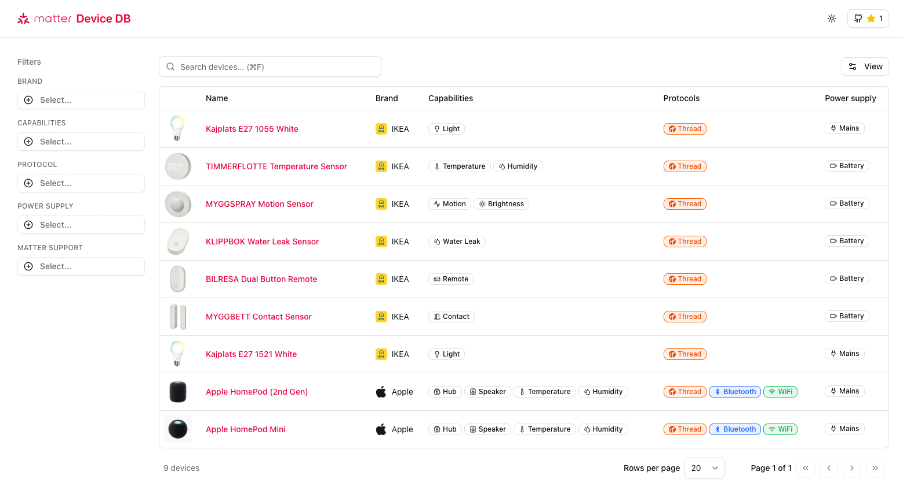

# Matter Device Database



A community-driven catalog of Matter-compatible smart home devices. Browse devices, filter by capabilities, protocols, and brands.

## Why?

I was looking for a site just like this and couldn't find anything that had all the info, was up to date or remotely pleasant to use. That's why I built my own.

## Quick Start

```bash
# Install dependencies
bun install

# Run development server
bun run dev
```

Open [http://localhost:3000](http://localhost:3000) to view the database.

## Contributing

Contributions are welcome! The easiest way to help is by adding devices you own or know about.
For now, there isn't really a workflow or anything for PRs. Just make the change and open a PR. In the future, I might make this a bit more streamlined...

> **Not comfortable with JSON or PRs?** No problem - just [open an issue](../../issues/new?template=new-device.yml) and fill out the form so someone else can do it!

### Adding a Device

1. Fork this repository
2. Edit `data/devices.json` and add your device entry:

```json
{
  "id": "brand-product-name",
  "name": "Product Display Name",
  "brand_id": "brand",
  "capabilities": ["light", "dimmer"],
  "protocols": ["thread"],
  "powerSupply": "mains",
  "matterSupport": "native",
  "imageUrl": "https://example.com/image.jpg",
  "productUrl": "https://example.com/product",
  "contributors": ["your-github-username"],
  "meta": {
    "last_updated": "2026-02-02"
  }
}
```

3. If the brand doesn't exist, add it to `data/brands.json`
4. Submit a pull request

### Device Fields

| Field           | Required | Description                                     |
| --------------- | -------- | ----------------------------------------------- |
| `id`            | Yes      | Unique identifier (lowercase, hyphens)          |
| `name`          | Yes      | Human-readable product name                     |
| `brand_id`      | Yes      | Reference to brand in `brands.json`             |
| `capabilities`  | Yes      | Array of device capabilities                    |
| `protocols`     | Yes      | Supported protocols (thread, wifi, bluetooth)   |
| `powerSupply`   | Yes      | Power source (mains, battery)                   |
| `matterSupport` | Yes      | Support type (native, bridge)                   |
| `imageUrl`      | No       | Product image URL                               |
| `productUrl`    | No       | Official product page                           |
| `contributors`  | Yes      | GitHub usernames who added/verified this device |

> Important Note on Images: For now, I just included a URL to an asset on the internet. This is obviously bad practice and in the future, the images will be hosted on GitHub(?) or another CDN. For now, feel free to be as lazy as I was.

### Capabilities

See `data/capabilities.tsx` for the full list as it might change in the future.

### Guidelines

- Verify the device actually supports Matter before adding
- Use official product images when possible
- Include yourself in the `contributors` array
- Update `meta.last_updated` when modifying entries

## Development

```bash
bun run dev    # Start dev server
bun run build  # Production build
bun run lint   # Run linter
```

## Tech Stack

- [Next.js](https://nextjs.org/) - React framework
- [Tailwind CSS](https://tailwindcss.com/) - Styling
- [shadcn/ui](https://ui.shadcn.com/) - UI components
- [TanStack Table](https://tanstack.com/table) - Data table

## License

MIT - See [LICENSE](LICENSE) for details.
